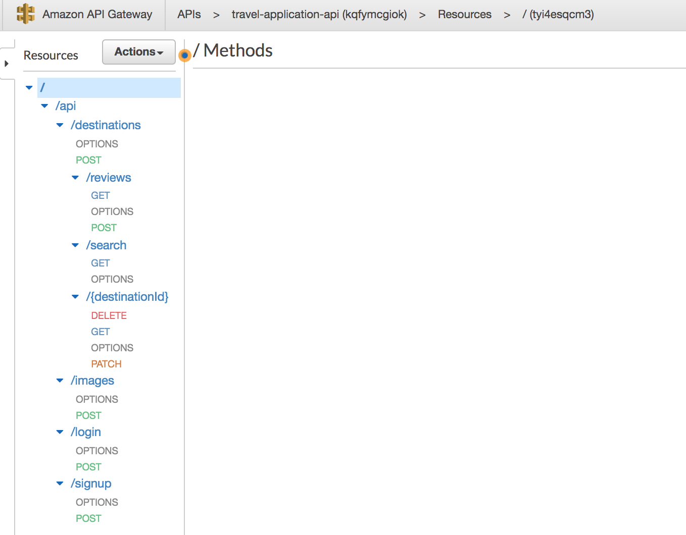

# How to run user-service

This application was designed to run in AWS Lambda. So you cannot run it locally.
This instruction covers how to run it in AWS cloud.

## Step 1 - install required programs in your local machine
- Recent LTS version (tested with v14.15.4) of Node.js
- Make sure `yarn` command is available
- Application was tested in Macbook. If you do not have Mac or Linux machine, please execute commands in `build.sh` file
as part of the step 2 instead of running `build.sh` file directly.

## Step 2 - Build the zip file
- Go the application directory `user-service`
- Run the script `build.sh` - (run `./build.sh` in your terminal)
- This creates a zip file `dist/web-controller.zip`

## Step 3 - Make sure you have all AWS cloud resources set up
See the guide below on how to set up cloud resources

## Step 4 - Upload the zip file to Lambda
Go to AWS Lambda service in AWS console and open user-service-web-controller Lambda. Upload the zip file built earlier.
After the zip file is uploaded, test the REST endpoints (`/signup` and `/login`) URL found in API gateway.

# ---------------------------------------------------
## How to set up cloud resources for backend services
Three backend services: user-service, destination-services and image-service is deployed to AWS cloud.
Before you can deploy them to the cloud, you need to set up some resources there. Please follow this step-by-step guide:

- Step 1: Create an AWS service account if you don't have it already
- Step 2: Go to S3 service of AWS and create a bucket named `destination-images`. Give public read access to the bucket.
- Step 3: Go to RDS service of AWS and allocate a PostgreSQL database. Enable username/password authentication and
  configure so that it will be accessible outside the vpc. (note the connection URL, username, password and database name).
- Step 4: Go DynamoDB service of AWS and create a table named `USER`
- Step 5: Go to AWS Lambda service and creates three Lambda services: user-service-web-controller,
  destination-service-web-controller and image-service-web-controller. Node.js should be selected as programming language
  for the Lambda.
- Step 6: Go to each of Lambdas and set following environment variable: SIGNIN_KEY. Give any secure text as password
   for token sign in key. This will be used to generate and verify token. They value should be same in each Lambdas.
- Step 7: Go to the destination-service-web-controller service and set following environment variables from the configuration:
  `PGDATABASE` - `postgres` by default.  `PGHOST` - PostgreSQL host. `PGPASSWORD` - password you set. `PGPORT` - port of the
  PostgreSQL, 5432 by default. `PGUSER` - username you set for the DB.
- Step 8: Go to API Gateway of AWS and create the following resources shown below:
  
- Step 9: Give image-service-web-controller Lambda the permission to access S3 bucket created
- Step 10: Give user-service-web-controller Lambda the permission to read and write to DynamoDB table created
- Step 11: Given API Gateway the access to invoke all AWS Lambda functions

  